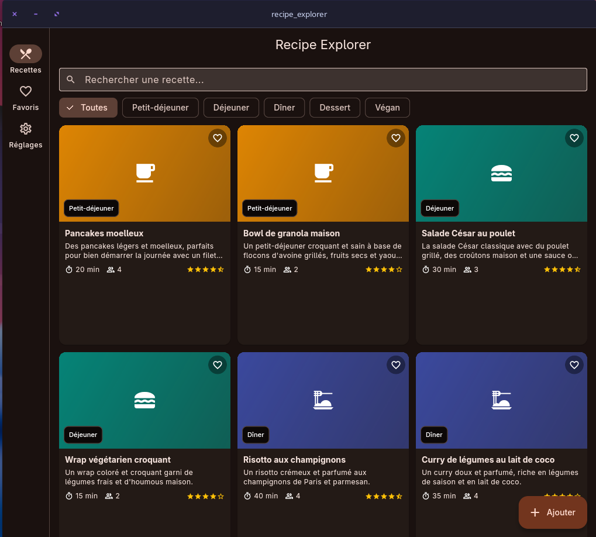
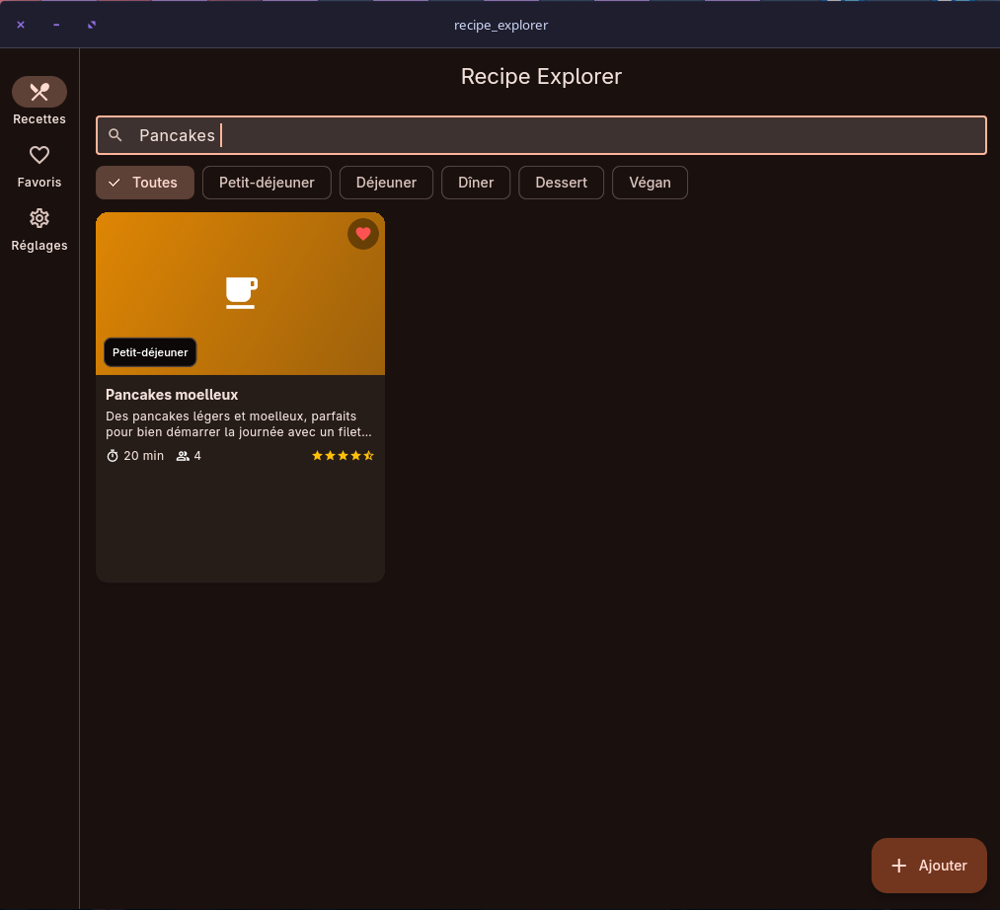
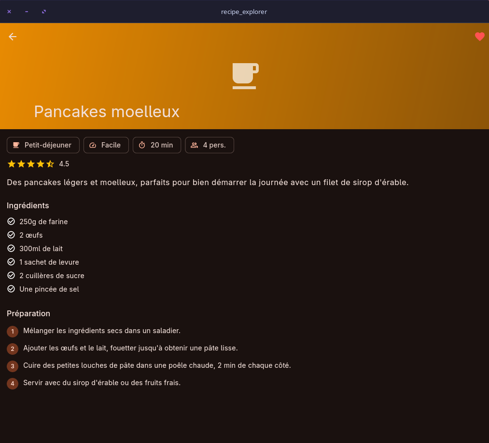
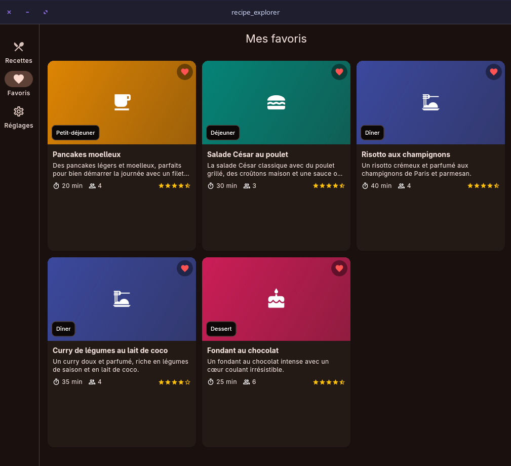
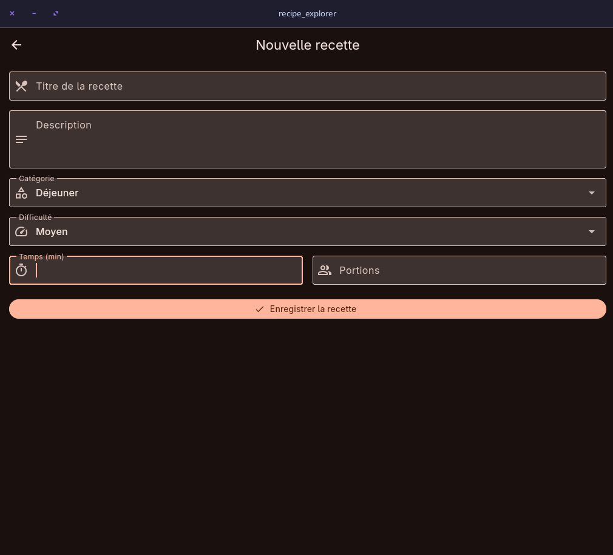
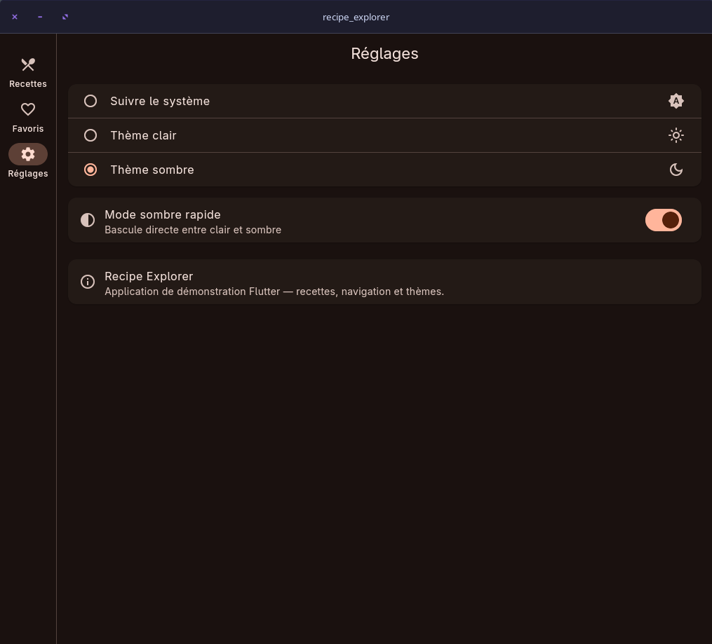

# Recipe Explorer 🍳

Application Flutter multi-écrans de démonstration : parcours de recettes de
cuisine, recherche/filtrage, détail avec ingrédients & étapes, ajout d'une
recette via un formulaire validé, favoris et thème clair/sombre.

## Fonctionnalités

- **5 écrans** : Liste des recettes, Détail, Favoris, Ajouter une recette, Réglages.
- **Navigation** avec [`go_router`](https://pub.dev/packages/go_router) (routes nommées, `StatefulShellRoute` pour la barre de navigation, paramètre de route `:id` pour l'écran de détail).
- **Recherche + filtres** par catégorie sur l'écran d'accueil.
- **Écran de détail** alimenté uniquement par l'identifiant de la recette passé dans l'URL (`/recipe/:id`), les données étant relues depuis le provider.
- **Formulaire** (`/add`) avec 5 champs validés : titre, description, catégorie, difficulté, temps de préparation, portions.
- **Thème clair / sombre / système**, persistant entre les sessions via `shared_preferences`.
- **Responsive** : liste verticale sur mobile, grille (2 ou 3 colonnes) sur tablette ; `BottomNavigationBar` sur mobile, `NavigationRail` sur tablette (bascule à 600px de large).

## Architecture

```
lib/
  main.dart               Point d'entrée, injection des providers
  app.dart                MaterialApp.router + thème
  models/                 Modèles de données (Recipe, enums)
  data/                   Source de données (mock, séparée de l'UI)
  providers/              État applicatif (ChangeNotifier) : recettes/favoris, thème
  router/                 Déclaration des routes nommées (go_router)
  screens/                Les 5 écrans de l'application
  widgets/                Widgets réutilisables :
    recipe_card.dart        carte recette (liste ou grille)
    search_filter_bar.dart  barre de recherche + filtres par catégorie
    rating_stars.dart       affichage d'une note en étoiles
    empty_state.dart        état vide générique
    adaptive_scaffold.dart  navigation adaptative mobile/tablette
```

Aucune donnée n'est codée en dur dans les widgets : tout provient de
`data/recipe_repository.dart` via `RecipeProvider`.

## Widgets utilisés

`MaterialApp.router`, `Scaffold`, `AppBar`, `SliverAppBar` / `CustomScrollView`,
`ListView`, `GridView`, `Stack`, `Card`, `Chip` / `FilterChip`, `Hero`,
`Form` / `TextFormField`, `DropdownButtonFormField`, `NavigationBar`,
`NavigationRail`, `RadioListTile`, `SwitchListTile`, `SnackBar`,
`FloatingActionButton`, `LayoutBuilder`.

## Lancer le projet

Prérequis : [Flutter SDK](https://docs.flutter.dev/get-started/install) (canal stable).

```bash
flutter pub get
flutter run
```

Pour lancer les tests :

```bash
flutter test
```

Pour tester le rendu tablette en local, lancez sur un émulateur/simulateur
en mode paysage ou redimensionnez la fenêtre (Flutter desktop/web) au-delà
de 600px de large.

## Captures d'écran

| Accueil | Recherche/filtrage | Détail |
|---|---|---|
|  |  |  |

| Favoris | Ajouter une recette | Réglages (sombre) |
|---|---|---|
|  |  |  |

## Choix techniques

- **Provider** pour l'état applicatif (liste de recettes, favoris, thème) : simple, suffisant pour la taille de l'app, et bien intégré avec `go_router`.
- **`StatefulShellRoute.indexedStack`** pour conserver l'état de chaque onglet (Recettes/Favoris/Réglages) lors de la navigation.
- **`shared_preferences`** pour persister uniquement le choix de thème (clair/sombre/système).
